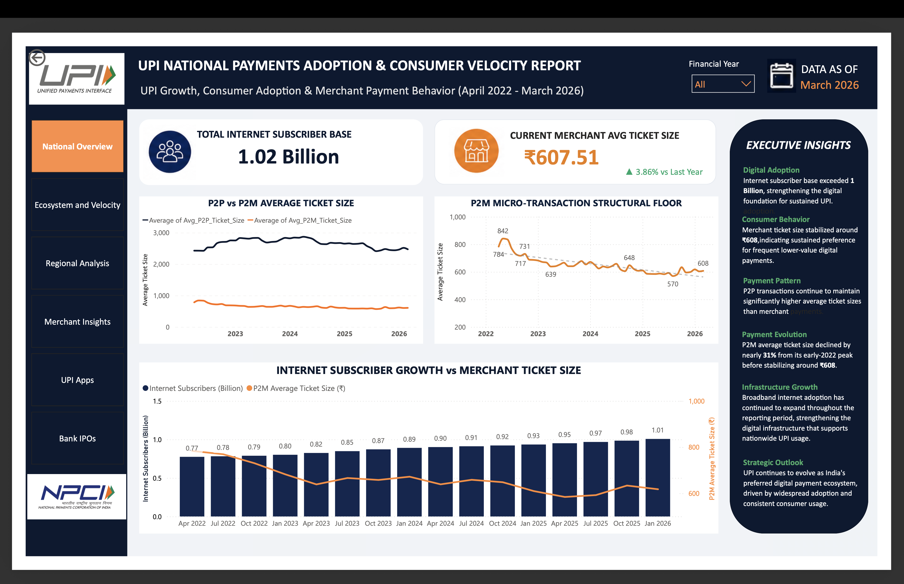
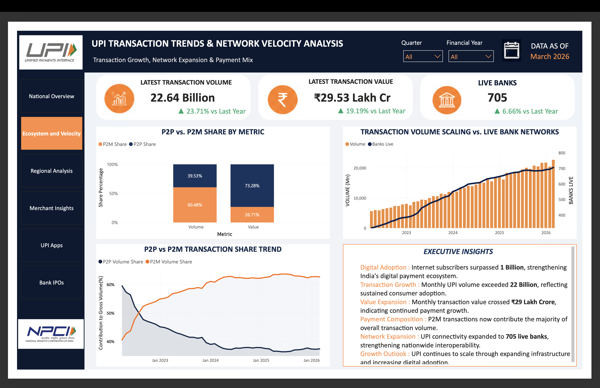
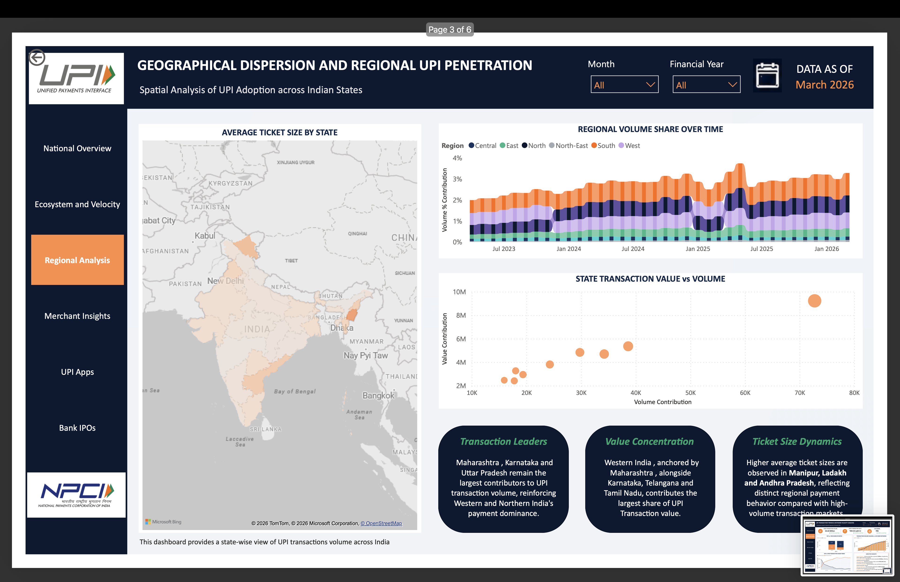
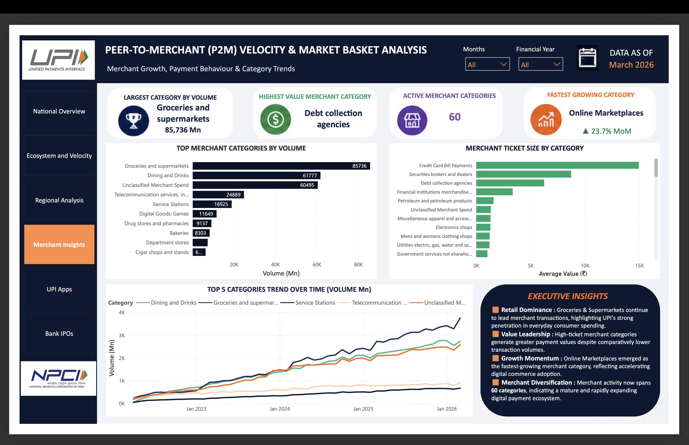
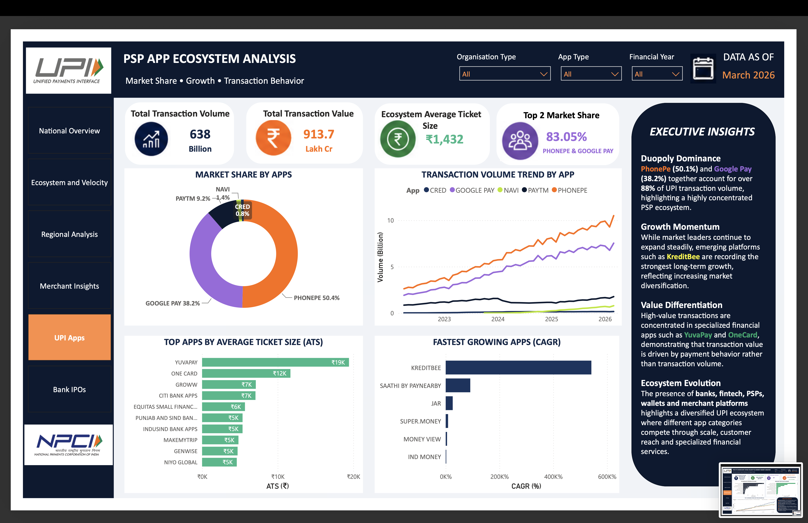
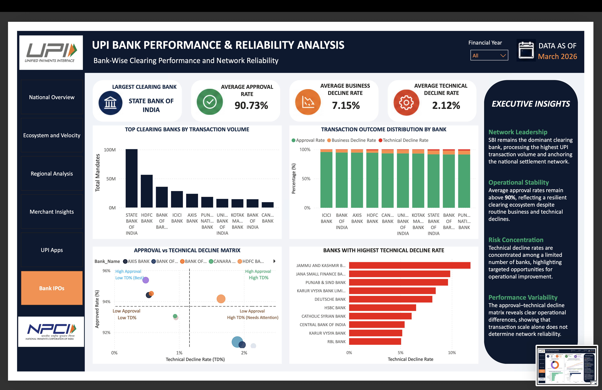

# UPI Systemic Risk & Ecosystem Analytics

### End-to-End Data Analytics | Machine Learning | Interactive Power BI Dashboard

An end-to-end analytics project exploring India's Unified Payments Interface (UPI) ecosystem using official NPCI transaction statistics. The project combines data preprocessing, exploratory data analysis, statistical and machine learning techniques, and interactive Power BI dashboards to uncover transaction trends, merchant behaviour, market concentration, regional adoption patterns, and banking reliability.

---

# 📊 Executive Dashboard

A **6-page interactive Power BI dashboard** was developed to transform complex analytical findings into executive-level business insights.

### Dashboard Modules

- 📈 National UPI Performance Overview
- 🚀 Ecosystem Growth & Transaction Velocity
- 🗺️ Regional Adoption & Geographic Analysis
- 🛍️ Merchant Payment Behaviour
- 📱 UPI App Ecosystem Analysis
- 🏦 Bank Performance & Operational Reliability

---

# 📷 Dashboard Preview

## National Overview



---

## Ecosystem Growth & Velocity



---

## Regional Analysis



---

## Merchant Behaviour



---

## UPI App Ecosystem



---

## Bank Performance



---

# 🎯 Business Objective

Although UPI has achieved unprecedented transaction growth, aggregate metrics often conceal underlying structural shifts within the ecosystem.

This project investigates:

- Evolution of transaction behaviour over time
- Merchant payment patterns across sectors
- Concentration within the UPI application ecosystem
- Operational reliability across clearing banks
- Regional differences in digital payment maturity

---

# 🔄 Analytics Workflow

```
NPCI Public Statistics
        │
        ▼
Data Cleaning & Preprocessing
        │
        ▼
Exploratory Data Analysis
        │
        ▼
Machine Learning & Statistical Analysis
        │
        ▼
Business Insights
        │
        ▼
Interactive Power BI Dashboard
```

---

# 🔬 Analytics & Machine Learning Pipeline

| Phase | Technique | Objective |
|------|-----------|-----------|
| Transaction Behaviour Forecasting | SARIMAX, XGBoost | Forecast Average Ticket Size and analyse structural divergence |
| Merchant Segmentation | K-Means Clustering | Identify merchant payment behaviour patterns |
| App Market Analysis | Herfindahl-Hirschman Index (HHI) | Measure market concentration within the UPI ecosystem |
| Bank Reliability Analysis | Linear Regression, Random Forest | Evaluate operational stress and technical decline patterns |
| Geographic Segmentation | K-Means Clustering | Classify states based on digital payment maturity |

---

# 📈 Dashboard Highlights

The Power BI dashboard includes:

- Executive KPI Cards
- Dynamic Financial Year Slicers
- Interactive Drill-down Analysis
- Geographic Performance Mapping
- Merchant Category Analysis
- UPI App Market Share Analysis
- Transaction Outcome Analysis
- Operational Risk Assessment
- Executive Insights

---

# 💡 Key Business Insights

- UPI transaction volumes continue to expand while Average Ticket Size demonstrates distinct structural trends.
- Merchant payments are increasingly dominated by low-value, high-frequency transactions, reflecting widespread adoption for everyday purchases.
- The UPI application ecosystem remains highly concentrated, with PhonePe and Google Pay accounting for the majority of transaction volume.
- Approval rates consistently remain above 90%, highlighting strong operational reliability despite isolated technical decline across select banks.
- Regional analysis reveals varying levels of digital payment maturity across Indian states and union territories.

---

# 🗂️ Repository Structure

```
UPI Analysis/
│
├── dashboard/
│   ├── screenshots/
│   ├── UPI Dashboard.pbix
│   └── UPI Dashboard.pdf
│
├── data/
│   ├── apps/
│   ├── banks/
│   ├── merchant/
│   ├── statewise/
│   ├── with_festive/
│   └── without_festive/
│
├── src/
│
├── eda/
│
├── models/
│
├── research/
│
└── README.md
```

---

# 📂 Repository Contents

### dashboard/
Interactive Power BI dashboard, exported report and dashboard screenshots.

### data/
Processed NPCI datasets organised by analytical domain.

### src/
Python scripts covering preprocessing, forecasting, clustering and analytical workflows.

### eda/
Exploratory Data Analysis outputs and generated visualisations.

### models/
Machine learning outputs including forecasting comparisons, feature importance, clustering and analytical visualisations.

### research/
Research paper and supporting documentation.

---

# 🛠️ Tech Stack

### Programming

- Python
- DAX

### Data Processing

- Pandas
- NumPy
- Microsoft Excel
- Power Query

### Machine Learning & Analytics

- Scikit-Learn
- XGBoost
- Statsmodels

### Data Visualization

- Microsoft Power BI
- Matplotlib
- Seaborn

---

# 📦 Data Source

Official transaction statistics published by the **National Payments Corporation of India (NPCI)**

Coverage Period:

**April 2022 – March 2026**

https://www.npci.org.in/product/bhim/product-statistics

---

# 🚀 Future Enhancements

- Automated dashboard refresh pipeline
- Real-time UPI monitoring dashboard
- Enhanced forecasting models
- Additional merchant behaviour analysis
- Interactive dashboard deployment

---

# 👩‍💻 Author

**Lipi Virmani**

MBA (Business Analytics)

Aspiring Data Analyst | Business Intelligence | Power BI | Data Analytics

GitHub: https://github.com/lipivirmani

---

# 📜 License

This repository is intended for educational, research and portfolio purposes. Data used in this project is sourced from publicly available NPCI statistics.
